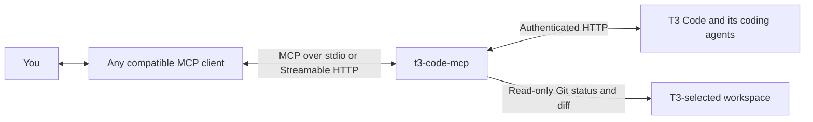

# t3-code-mcp

An MCP gateway that lets MCP clients interact with T3 Code agents: find projects and threads, start tasks, check progress, retrieve results, and respond to requests for input.

It connects to one configured T3 Code environment and supports local stdio and remote Streamable HTTP connections for desktop assistants, hosted clients, and custom integrations.

The original idea was to pair it with GPTVoice's tool calls to start tasks and get agent updates by voice while on the go.



## What you can do

- Find projects and threads, inspect progress, and retrieve agent responses.
- Inspect structured Git status and bounded staged or unstaged diffs in T3-selected workspaces.
- Create threads, start tasks, respond to input requests, and interrupt work.
- Snooze, settle, reopen, and archive threads.
- Connect through local stdio or authenticated Streamable HTTP.

The gateway uses T3's authenticated HTTP orchestration API. The recorded integration target is T3 `v0.0.41-nightly.20260910.1507`; pin and test the version used by your deployment. See [usage and tool behavior](docs/usage.md) for examples, supported tools, and current limits.

## Security

**Write access lets a client control your T3 coding agent with that agent's machine permissions.** New threads default to `full-access`, and the client can answer approval requests without independent human verification. Read-only access still exposes thread content and project information.

Start with `MCP_READ_ONLY=true`, connect only trusted clients, and review the [security and access risks](docs/security.md) before enabling remote access or control tools.

## Quick start

Install Node.js 20.6 or newer and pnpm, then run from the repository root:

```sh
pnpm install
pnpm build
cp .env.example .env
chmod 600 .env
```

Edit `.env`: set `T3_ACCESS_TOKEN`, a separate random `MCP_BEARER_TOKEN`, and `MCP_READ_ONLY=true`. Set `T3_HTTP_BASE_URL` if T3 is not at `http://127.0.0.1:3773`.

For HTTP, set `MCP_TRANSPORT=http` and start the gateway:

```sh
node --env-file=.env dist/cli.js serve
```

Connect your MCP client to `http://127.0.0.1:8787/mcp` with `Authorization: Bearer <MCP_BEARER_TOKEN>`. This address is local to the gateway machine; remote clients need an authenticated tunnel or HTTPS proxy. For a local client that launches the process, use `MCP_TRANSPORT=stdio` instead.

Request connection status, list projects, and read an existing thread to verify the connection. Follow the [configuration and client connection guide](docs/configuration.md) for all environment variables and the first write-enabled check.

## Documentation

| Guide | Contents |
| --- | --- |
| [Usage and tool behavior](docs/usage.md) | Example requests, thread lifecycle, status fields, retries, and current limits |
| [Configuration and client connections](docs/configuration.md) | Environment variables, transports, connection checks, and integration references |
| [Security and access risks](docs/security.md) | Host access, credentials, approvals, data exposure, deployment risks, and mitigations |
| [Linux deployment](docs/deployment.md) | Systemd services, tunnel setup, credentials, and startup checks |
| [Development and verification](docs/development.md) | Build and test commands, diagnostics, and opt-in live integration tests |

## Upstream work that would improve this gateway

These open items in [pingdotgg/t3code](https://github.com/pingdotgg/t3code) each remove or reduce a limit described in [current limits](docs/usage.md#current-limits). This gateway needs no change for most of them; it reads the same server state. State checked 2026-09-11.

| Gateway limit | Upstream item | Effect here |
| --- | --- | --- |
| Busy threads reject new turns. Queueing and steering are not implemented. | Issue [#9672](https://github.com/pingdotgg/t3code/issues/9672), PR [#7240](https://github.com/pingdotgg/t3code/pull/7240), PR [#10132](https://github.com/pingdotgg/t3code/pull/10132) | Server-side queued turn intent (`after-current`) would let `t3_thread_send` queue a follow-up instead of returning `thread_busy`, and would keep the queued message after a restart. |
| Interrupt acceptance never confirms a stop, so the gateway must poll and report a separate verification result. | Issue [#4713](https://github.com/pingdotgg/t3code/issues/4713), issue [#8618](https://github.com/pingdotgg/t3code/issues/8618) | Both describe interrupt requests recorded as accepted while the session projection stays `running`. A terminal session event after interruption would make `verification` reliable instead of best effort. |
| Pending-action details are inferred from activity records and can include historical entries. | Issue [#5454](https://github.com/pingdotgg/t3code/issues/5454), PR [#10586](https://github.com/pingdotgg/t3code/pull/10586), PR [#8425](https://github.com/pingdotgg/t3code/pull/8425), issue [#7825](https://github.com/pingdotgg/t3code/issues/7825) | Server-side dismissal of orphaned questions and of approvals on revert would make `t3_pending_actions_list` match what the agent can still accept. #7825 covers request types reported as unknown. |
| The HTTP orchestration route does not implement every WebSocket command field. | Issue [#8319](https://github.com/pingdotgg/t3code/issues/8319), PR [#7996](https://github.com/pingdotgg/t3code/pull/7996) | `thread.turn.start` with `bootstrap` fails over HTTP with an untyped 500. The PR adds parity plus a typed rollback reason, which would allow one-call thread creation with worktree and setup script. |
| There are no push notifications. `t3_run_wait` polls and can return before completion. | Issue [#10929](https://github.com/pingdotgg/t3code/issues/10929) | An authenticated read-only thread status stream would replace polling for run progress and pending requests, and would lower load for always-on clients. |
| Settled and open lists can differ from the T3 UI, which derives settlement from inputs the API does not expose. | Issue [#5476](https://github.com/pingdotgg/t3code/issues/5476), issue [#6368](https://github.com/pingdotgg/t3code/issues/6368), issue [#10099](https://github.com/pingdotgg/t3code/issues/10099) | These report PR-driven auto-settling, completion waking snoozed threads, and clients disagreeing about settlement. Server-owned lifecycle state would let `status` and `statusReason` agree with every client. |
| Failure reporting does not separate a usage limit from a crash. | Issue [#10545](https://github.com/pingdotgg/t3code/issues/10545) | A distinct reason would let `needsAttention` and thread `warning` tell a blocked subscription from a real failure. |
| `T3_ACCESS_TOKEN` cannot be narrowed. `t3 auth session issue` mints `AuthAdministrativeScopes` only, so `MCP_READ_ONLY=true` is enforced by this gateway, not by the T3 token. | PR [#10411](https://github.com/pingdotgg/t3code/pull/10411) | `t3 drive` mints a per-invocation session holding only `orchestration:read`, adds `orchestration:operate` for mutations, and revokes it afterwards. The server therefore supports narrow sessions already; a scope flag on `t3 auth session issue` would let a read-only deployment hold a read-only token. The `drive` commands themselves are an HTTP client for the same orchestration endpoints, so they are not a transport alternative for this gateway. |
| The gateway reports credential expiry but cannot influence it. | Issue [#9884](https://github.com/pingdotgg/t3code/issues/9884) | Session lifetime is currently chosen by credential type, and the plain bearer token this gateway uses gets the long 30-day session. A corrected policy changes how often `T3_ACCESS_TOKEN` must be rotated. |
