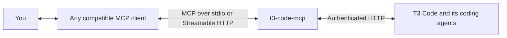

# t3-code-mcp

An MCP gateway that lets MCP clients interact with T3 Code agents: find projects and threads, start tasks, check progress, retrieve results, and respond to requests for input.

It connects to one configured T3 Code environment and supports local stdio and remote Streamable HTTP connections for desktop assistants, hosted clients, and custom integrations.

The original idea was to pair it with GPTVoice's tool calls to start tasks and get agent updates by voice while on the go.



## What you can do

- Find projects and threads, inspect progress, and retrieve agent responses.
- Create threads, start tasks, respond to input requests, and interrupt work.
- Snooze, settle, reopen, and archive threads.
- Connect through local stdio or authenticated Streamable HTTP.

The gateway uses T3's authenticated HTTP orchestration API. The recorded integration target is T3 `v0.0.41-nightly.20260910.1507`; pin and test the version used by your deployment. See [usage and tool behavior](docs/usage.md) for examples, supported tools, and current limits.

## Security

**Write access lets a client control your T3 coding agent with that agent's machine permissions.** New threads default to `full-access`, and the client can answer approval requests without independent human verification. Read-only access still exposes thread content and project information.

Start with `MCP_READ_ONLY=true`, connect only trusted clients, and review the [security and access risks](docs/security.md) before enabling remote access or control tools.

## Quick start

Install Node.js 20.6 or newer and pnpm, then run from the repository root:

```sh
pnpm install
pnpm build
cp .env.example .env
chmod 600 .env
```

Edit `.env`: set `T3_ACCESS_TOKEN`, a separate random `MCP_BEARER_TOKEN`, and `MCP_READ_ONLY=true`. Set `T3_HTTP_BASE_URL` if T3 is not at `http://127.0.0.1:3773`.

For HTTP, set `MCP_TRANSPORT=http` and start the gateway:

```sh
node --env-file=.env dist/cli.js serve
```

Connect your MCP client to `http://127.0.0.1:8787/mcp` with `Authorization: Bearer <MCP_BEARER_TOKEN>`. This address is local to the gateway machine; remote clients need an authenticated tunnel or HTTPS proxy. For a local client that launches the process, use `MCP_TRANSPORT=stdio` instead.

Request connection status, list projects, and read an existing thread to verify the connection. Follow the [configuration and client connection guide](docs/configuration.md) for all environment variables and the first write-enabled check.

## Documentation

| Guide | Contents |
| --- | --- |
| [Usage and tool behavior](docs/usage.md) | Example requests, thread lifecycle, status fields, retries, and current limits |
| [Configuration and client connections](docs/configuration.md) | Environment variables, transports, connection checks, and integration references |
| [Security and access risks](docs/security.md) | Host access, credentials, approvals, data exposure, deployment risks, and mitigations |
| [Linux deployment](docs/deployment.md) | Systemd services, tunnel setup, credentials, and startup checks |
| [Development and verification](docs/development.md) | Build and test commands, diagnostics, and opt-in live integration tests |
